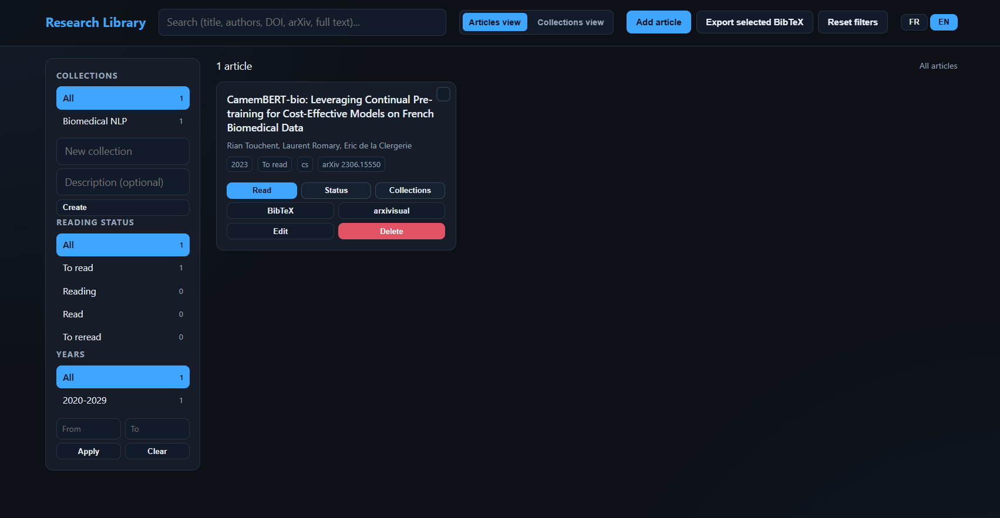
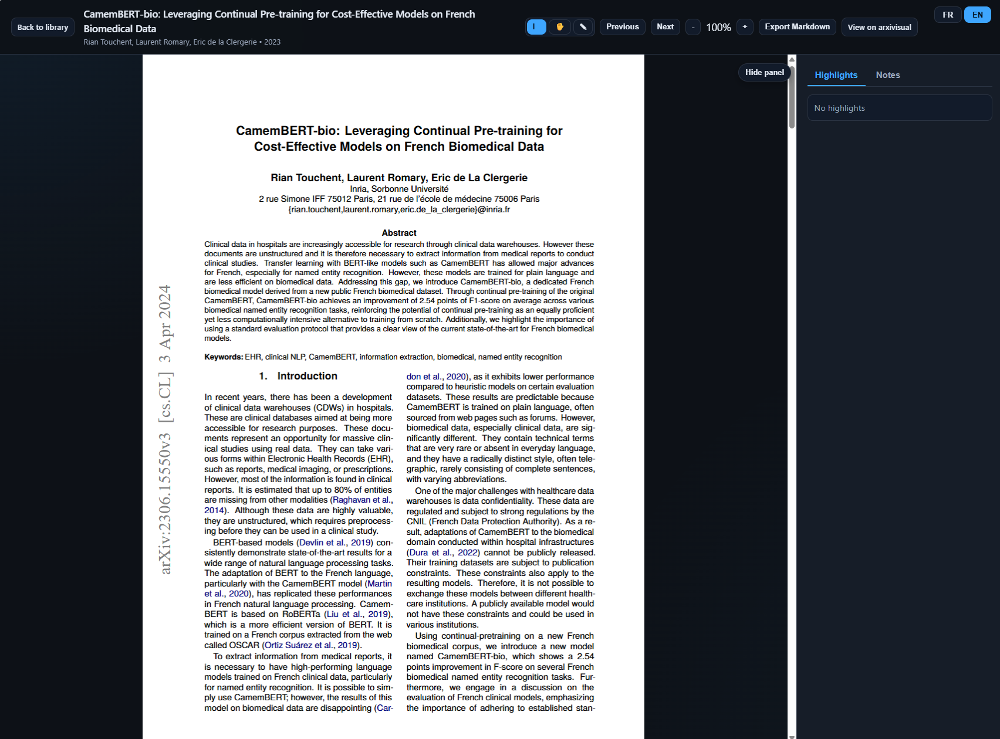

# Research Library

> A personal library for researchers — manage, read, and annotate scientific PDFs in your browser.

[](https://www.python.org/)
[](https://flask.palletsprojects.com/)
[](LICENSE)
[](https://sqlite.org/)

---

## Visualization





---

## Features

|                    | Feature                                                            |
| ------------------ | ------------------------------------------------------------------ |
| **Import**   | Upload local PDFs or import directly from an arXiv URL/ID          |
| **Metadata** | Auto-fetch title, authors, abstract, DOI, year, journal from arXiv |
| **Organize** | Create collections, assign papers, track reading status            |
| **Search**   | Full-text search across title, authors, abstract, and PDF content  |
| **Filter**   | Filter by collection, status, year range, or decade buckets        |
| **Read**     | Built-in PDF reader (PDF.js) with zoom and page navigation         |
| **Annotate** | Colored text highlights and page-anchored notes                    |
| **Export**   | BibTeX (single or bulk) and Markdown annotation export             |

---

## Quick Start

```bash
# 1. Clone the repo
git clone <your-repo-url>
cd Researcher_library

# 2. Create and activate a virtual environment
python3 -m venv .venv
source .venv/bin/activate        # Linux/macOS
.venv\Scripts\activate           # Windows

# 3. Install dependencies
pip install -r requirements.txt

# 4. Run the app
python run.py
```

Open [http://127.0.0.1:5000](http://127.0.0.1:5000) in your browser.

---

## Usage

### Adding papers

**From arXiv** — Paste an arXiv URL or ID (e.g. `2310.01234`). Metadata and PDF are fetched automatically.

**From a local PDF** — Upload a PDF file (up to 200 MB). Metadata is extracted from the PDF and can be edited manually.

---

### Organizing your library

- **Collections** — Create collections from the sidebar and assign papers to them via the card quick-actions.
- **Reading status** — Mark papers as *unread*, *reading*, or *read* directly from the card.

---

### Searching and filtering

- Type in the search bar to search across **title, authors, abstract, DOI, arXiv ID, and full PDF text**.
- Use the **Collection**, **Status**, and **Year** facets in the sidebar to narrow down results.
- Enter a custom year range with the **From / To** fields and press `Apply` or `Enter`.

Filters interact intelligently: status counts update with the active year range, and decade buckets update with the active status filter.

---

### Reading and annotating

1. Double-click a card (or click **Read**) to open the built-in reader.
2. **Select text** on a page to create a colored highlight.
3. **Click anywhere** on a page to add a note.
4. Manage highlights and notes from the side panel.
5. Export all annotations for a paper to **Markdown** with one click.

---

## Configuration

All configuration lives in [`app/config.py`](app/config.py).

| Variable                    | Default        | Description                       |
| --------------------------- | -------------- | --------------------------------- |
| `SQLALCHEMY_DATABASE_URI` | `library.db` | SQLite database path              |
| `UPLOAD_FOLDER`           | `uploads/`   | PDF storage folder                |
| `MAX_CONTENT_LENGTH`      | 200 MB         | Maximum upload size               |
| `ALLOWED_EXTENSIONS`      | `{"pdf"}`    | Accepted file types               |
| `FULLTEXT_MAX_CHARS`      | —             | Max PDF text stored for search    |
| `ARXIVISUAL_URL_TEMPLATE` | —             | URL template for arxivisual links |

---

## Project Structure

```
Researcher_library/
├── run.py                  # Entry point
├── requirements.txt
├── app/
│   ├── config.py
│   ├── models.py           # SQLAlchemy models
│   ├── routes/
│   │   ├── articles.py
│   │   ├── collections.py
│   │   ├── annotations.py
│   │   └── reader.py
│   ├── services/
│   │   ├── article_service.py
│   │   ├── arxiv_service.py
│   │   ├── bibtex_service.py
│   │   ├── file_service.py
│   │   └── search_service.py
│   ├── static/
│   │   ├── css/style.css
│   │   └── js/
│   │       ├── library.js
│   │       ├── reader.js
│   │       └── annotations.js
│   └── templates/
│       ├── base.html
│       ├── library.html
│       └── reader.html
└── uploads/                # Stored PDFs (gitignored except .gitkeep)
```

---

## API Reference

<details>
<summary>Articles</summary>

| Method     | Endpoint                           | Description                                                         |
| ---------- | ---------------------------------- | ------------------------------------------------------------------- |
| `GET`    | `/api/articles`                  | List articles (filters:`q`, `collection`, `status`, `year`) |
| `POST`   | `/api/articles`                  | Add a new article                                                   |
| `GET`    | `/api/articles/<id>`             | Get article details                                                 |
| `PATCH`  | `/api/articles/<id>`             | Update article metadata                                             |
| `DELETE` | `/api/articles/<id>`             | Delete an article                                                   |
| `POST`   | `/api/articles/<id>/fetch-arxiv` | Re-fetch metadata from arXiv                                        |
| `GET`    | `/api/articles/<id>/bibtex`      | Export single BibTeX                                                |
| `POST`   | `/api/articles/bibtex-bulk`      | Export bulk BibTeX                                                  |

</details>

<details>
<summary>Collections</summary>

| Method     | Endpoint                                        | Description                    |
| ---------- | ----------------------------------------------- | ------------------------------ |
| `GET`    | `/api/collections`                            | List collections               |
| `POST`   | `/api/collections`                            | Create a collection            |
| `PATCH`  | `/api/collections/<id>`                       | Rename a collection            |
| `DELETE` | `/api/collections/<id>`                       | Delete a collection            |
| `POST`   | `/api/collections/<id>/articles`              | Add article to collection      |
| `DELETE` | `/api/collections/<id>/articles/<article_id>` | Remove article from collection |

</details>

<details>
<summary>Annotations</summary>

| Method           | Endpoint                                  | Description                    |
| ---------------- | ----------------------------------------- | ------------------------------ |
| `GET/POST`     | `/api/articles/<id>/highlights`         | List or create highlights      |
| `PATCH/DELETE` | `/api/highlights/<id>`                  | Edit or delete a highlight     |
| `GET/POST`     | `/api/articles/<id>/notes`              | List or create notes           |
| `PATCH/DELETE` | `/api/notes/<id>`                       | Edit or delete a note          |
| `GET`          | `/api/articles/<id>/annotations/export` | Export annotations to Markdown |

</details>

---

## Data and Persistence

The database and uploaded files are created locally on first run — no external services required.

- **Database**: `library.db` (SQLite, auto-created by SQLAlchemy)
- **PDFs**: stored in `uploads/`

To reset all local data:

```bash
rm -f library.db
rm -f uploads/*.pdf
```

---

## Known Limitations

- Scanned PDFs (image-only) provide limited text extraction and search quality.
- Full-text search uses SQL `LIKE` — not FTS5 (no fuzzy matching).
- `run.py` uses `debug=True`, intended for local development only.
- For papers added from option PDF file, metadata aren't extracted and stored.

---

## License

[MIT](LICENSE) — Amaury Fierens, 2026.
